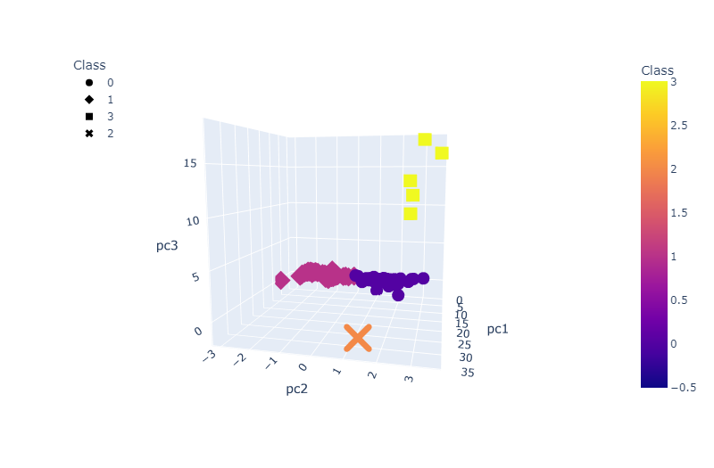
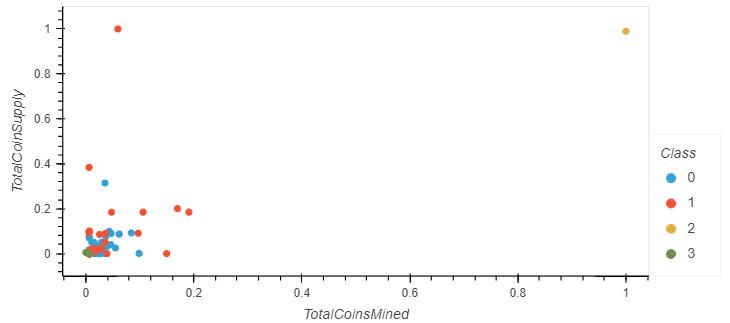

# ML_Cryptocurrencies

## Project Overview

This project presents a machine learning analysis to a client interested in offering a cryptocurrency portfolio. I collected current crypto market offerings which are grouped into a classification system. 

I leverage unsupervised learning and the K-means algorithm to group the cryptocurrencies. I also provide a 3D plot for visualization.

### Deliverables

- D1: Preprocess the data for PCA
- D2: Reduce dimensions with PCA
- D3: Cluster cryptocurrencies with K-means algorithm
- D4: Visualize cryptocurrency results

### Results

**3D plot pf 4 classes**

**Coin supply vs coins mined plot**

### Resources

- Data: crypto_data.csv
- Technology: Jupyter Notebook, Python 3.7, Pandas, Plotly, hvPlot, sklearn